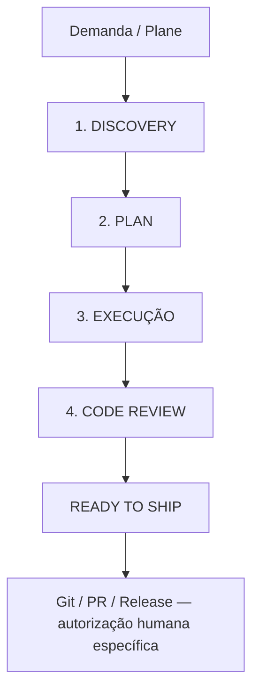

# WebFit Engineering Harness

O harness conduz demandas com exatamente quatro fases principais pelo entrypoint $webfit-task:



READY TO SHIP é resultado técnico, não quinta fase nem autorização para publicar. A invocação explícita autoriza as quatro fases no escopo, sem pedir “Posso implementar?” após Plan aderente. Decisões materiais e operações sensíveis não autorizadas bloqueiam só o trabalho dependente. Aceite final, dados reais e gates de produto permanecem humanos.

## Responsabilidades internas

| Fase | Responsabilidades absorvidas | Resultado |
|---|---|---|
| Discovery | Intake, Plane, pesquisa, contexto local, Specification e Clarify | DISCOVERY COMPLETE ou bloqueio concreto |
| Plan | Arquitetura/ADR quando necessário, plano, checklist, tarefas, análise e Scope Check | PLAN APPROVED BY SCOPE ou PLAN REQUIRES HUMAN DECISION |
| Execução | Implement, convergência interna, testes e correções no escopo | EXECUTION COMPLETE ou BLOCKED |
| Code Review | Verification, review independente, segurança/UI condicionais e Evidence | REVIEW PASSED / WITH WARNINGS / CHANGES REQUIRED |

Essas responsabilidades e prompts especializados não são etapas obrigatórias separadas. LIGHT/STANDARD/STRICT são profundidades das quatro fases: LIGHT usa Discovery curta/Plan inline, STANDARD contexto/plano suficientes, STRICT reforça riscos, autorização específica e review. Banco/saúde/autenticação continuam STRICT.

## Iniciar ou retomar

```text
$webfit-task Quero corrigir [problema].
$webfit-task WEBFIT-12
```

Investigar, classificar e conduzir no mesmo chat. STANDARD/STRICT obtêm ID Plane antes dos artefatos formais, buscando item existente para evitar duplicação; LIGHT dispensa Plane. Retomada começa na primeira atividade pendente, com artefatos/aprovações válidos.

Planejamento persistente novo prefere um único specs/WEBFIT-XX/task.md conforme [template](templates/task.md). Não criar árvore de specs no harness, converter nem apagar históricos. Spec Kit permanece ferramenta opcional conforme [contrato](integrations/spec-kit.md), sem cadeia completa obrigatória.

## Acompanhamento no chat

**Phase Summary — Resumo Executivo por Fase:** ao concluir cada fase STANDARD/STRICT, apresentar resumo verificável imediatamente antes de avançar, com status/ID Plane, conteúdo da fase, riscos/limites e documentação realmente criada/modificada. LIGHT breve pode agrupar alteração/revisão. Bloqueio recebe resumo parcial; trabalho demorado recebe progresso útil.

Resumos são informativos, sem fases, gates, arquivos exclusivos ou escritas Plane extras. O avanço no escopo segue automático. Conteúdo e estados PASS/FAIL/WARNING/NOT RUN/NOT APPLICABLE estão no [contrato de interação](HUMAN-INTERACTION-CONTRACT.md#phase-summary--resumo-executivo-por-fase).

## Controles e contexto

- [Governança](GOVERNANCE.md): fontes, autoridade, Scope Check, retomada e Git humano.
- [Autonomia](AUTONOMY-POLICY.md) e [interação](HUMAN-INTERACTION-CONTRACT.md): decisões provisórias visíveis, validação em lote, ASK-FIRST e comunicação.
- [Segurança](security/POLICY.md): dados fictícios, backend autorizado, secrets protegidos e review.
- [Integrações](integrations/README.md): Plane gestão, Obsidian conhecimento nos mesmos arquivos, Impeccable condicional, Mantis preparado e DefectDojo futuro. Mermaid é opcional para compreender fluxos/arquitetura, sem instalação/fase.
- [Skills locais](integrations/codex-skill.md): webfit-task, webfit-checkpoint e webfit-verificar.

PROJECT STAGE: IMPLEMENTING; G5 autorizado pela DEC-045 com dados fictícios; G5/G6/G7 não concluídos. [Checkpoint](../docs/project/status.md) guarda estado/próxima ação. Todas as demandas usam branch atual; Maycon controla Git (DEC-054). Sem scheduler/loop persistente ativo. Fonte desta refatoração: [DEC-057](../docs/project/decision-log.md#dec-057--harness-com-quatro-fases).
