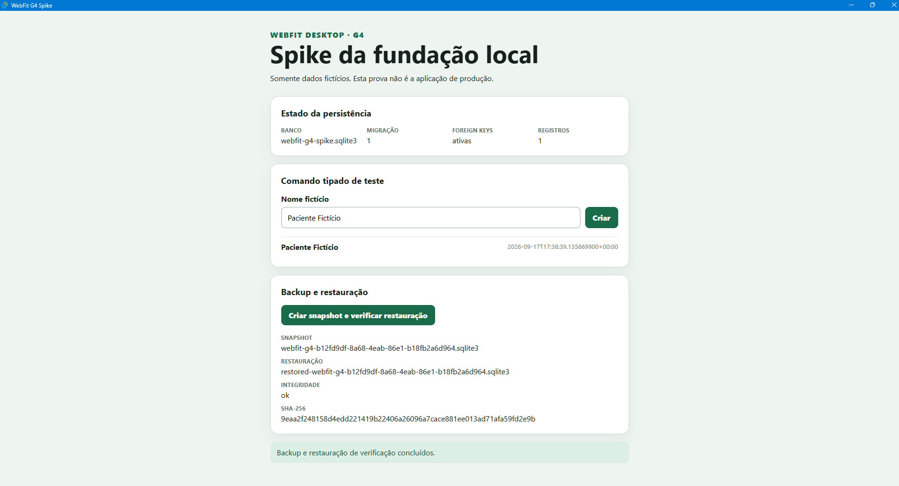

# Evidência do spike G4 — 2026-09-17

## Estado

- G4 autorizado por Maycon em 2026-09-17; execução técnica concluída e **decisão humana pendente**.
- Work Item: `WEBFIT-3`, módulo Fundação, estado Planning, vínculo legado `PBI-001`.
- Scaffold descartável: `spikes/g4-tauri-foundation/`.
- Esta evidência não aprova arquitetura nem schema de produção.

## Ambiente

- Windows 11 Pro AMD64.
- Node.js 22.21.0 e npm 10.9.4.
- Rust/Cargo 1.98.1, host `x86_64-pc-windows-msvc`.
- Microsoft C++ Build Tools 17.14.41 com VCTools.
- WebView2 presente.
- Tauri 2.11.5; React 19.1; TypeScript 6.0; Vite 8.3.
- `rusqlite` 0.40.2 com SQLite embutido, API de backup online e feature opcional SQLCipher.

## Evidência executada

| Critério | Resultado em 2026-09-17 |
|---|---|
| shell Tauri | PASS — executável iniciou e expôs janela `WebFit G4 Spike` |
| diretório de dados | PASS — `%APPDATA%\com.webfit.spike.g4\webfit-g4-spike.sqlite3` |
| migração versionada | PASS — migração `0001`, transação e checksum registrados |
| foreign keys | PASS — ativadas por conexão e violação exercitada em teste |
| fronteira WebView | PASS — somente quatro comandos tipados; não há comando SQL genérico |
| criar/listar paciente fictício | PASS em teste Rust/SQLite e validação manual na interface; a imagem abaixo registra 1 paciente fictício persistido |
| persistência após reabrir | PASS automatizado ao fechar e reabrir conexões; ciclo manual completo da UI não executado porque o controlador de interface falhou antes da captura de estado |
| backup consistente | PASS — SQLite Online Backup API |
| restauração de verificação | PASS — cópia em área separada, SHA-256 igual e `integrity_check=ok` |
| SQLCipher | PASS no candidato — banco sem cabeçalho SQLite, leitura com chave correta, rejeição de chave incorreta, exportação criptografada, checksum, restauração e `integrity_check=ok` |
| armazenamento de chave | PASS no candidato — DPAPI `CurrentUser` protegeu 32 bytes efêmeros e recuperou exatamente a chave sem sequência em claro no blob; política de recuperação ainda requer decisão |
| proteção de backup | PASS técnico — `sqlcipher_export` gerou backup criptografado, restaurado com a chave correta e integridade válida |
| pacote portátil e custódia | PASS no spike — envelope de chave protegido pela credencial administrativa fictícia, checksum validado, cópia em nuvem simulada, restauração em instalação separada, auditoria SUCCESS e rejeição de credencial incorreta; logs não contêm chave, credencial ou nome de paciente |
| caminhos e falhas | PASS — caminho `Clínica São José`, pai inutilizável e SQLite cheio foram exercitados sem gravação parcial |
| CSP | PASS no spike — `default-src 'self'; connect-src ipc: http://ipc.localhost; object-src 'none'; base-uri 'self'; frame-ancestors 'none'` |
| instalador Windows | PASS NSIS; MSI gerado. O ensaio limpo do MSI foi inconclusivo porque o Windows Installer não finalizou; não houve entrada de desinstalação nem instalação parcial detectável |
| testes proporcionais | PASS — 7 testes padrão, 2 testes SQLCipher, build TypeScript/Vite, formatação e Clippy |

## Comandos validados

- `npm run build` — PASS.
- `cargo fmt --all -- --check` — PASS.
- `cargo test` — PASS: 7 testes, 0 falhas.
- `cargo test --no-default-features --features sqlcipher-spike sqlcipher_encrypts_database_and_rejects_wrong_key` — PASS: 1 teste, 0 falhas.
- `cargo test --no-default-features --features sqlcipher-spike portable_backup` — PASS: 1 teste, 0 falhas; pacote portátil, nuvem simulada, restauração separada, auditoria e credencial incorreta.
- `cargo test --no-default-features --features sqlcipher-spike` — PASS confirmado por Maycon: 9 testes, 0 falhas, sem testes filtrados.
- `cargo clippy --all-targets -- -D warnings` — PASS.
- `npm run tauri build` — PASS; executável, MSI e NSIS gerados.
- abertura controlada do executável — PASS; processo ativo e título da janela confirmado.
- instalação e desinstalação silenciosa do NSIS — PASS; saída 0, diretório e entrada de desinstalação removidos. Dados fictícios do perfil foram preservados.

## Limites e riscos abertos

- A autorização é uma prova de barreira Rust com sessão interna fictícia; autenticação real não foi implementada.
- SQLCipher Community compilou e funcionou, mas licença/suporte e adoção em produção dependem de decisão explícita.
- DPAPI `CurrentUser` vincula a chave ao usuário/contexto Windows; recuperação em outra conta ou máquina e estratégia de chave do backup permanecem decisões humanas.
- Uma compilação SQLCipher totalmente limpa precisa de Perl completo por causa do OpenSSL vendorizado. A prova usou extração administrativa temporária do Strawberry Perl, removida após o teste.
- O linker emitiu avisos `LNK4099` sobre símbolos de depuração ausentes do OpenSSL; não houve falha de link nem de execução, mas o empacotamento de release deve acompanhar esse risco.
- O ciclo de clique completo pela UI não foi executado porque o controlador de interface encerrou inesperadamente em duas tentativas; persistência e reabertura foram cobertas por teste automatizado e o binário instalado foi aberto com sucesso.
- O MSI foi gerado, mas a instalação limpa exercitada foi a variante NSIS. Uma tentativa silenciosa posterior do MSI não concluiu; o processo foi interrompido após espera prolongada, sem registro ou diretório de instalação parcial detectável.
- O pacote portátil é uma prova de custódia; a credencial administrativa fictícia ainda não representa autenticação, autorização ou gestão de chaves de produção.
- O armazenamento em nuvem foi simulado por cópia local; não houve integração externa.
- O schema serve somente à prova técnica; não é o schema aprovado do produto.

## Recomendação

**REVISAR.** A composição é tecnicamente viável, mas a adoção de SQLCipher, a política de custódia/recuperação de chaves e backups e a aceitação dos riscos residuais precisam de aprovação antes do G5. Repetir o ciclo manual de UI quando o controlador estiver disponível; isso não invalida as provas automatizadas já concluídas.
## Evidência visual do primeiro spike

A validação manual confirmou a criação de um paciente fictício e a execução do snapshot com restauração verificada pela interface. O estado exibido registra migração `1`, foreign keys ativas, um registro persistido, snapshot, restauração, integridade `ok` e SHA-256.

Esta imagem é evidência do comportamento do spike descartável; não representa a aplicação de produção nem contém dados reais de pacientes.

## Decisão humana final — 2026-09-21

Maycon aprovou integralmente a política operacional sem custo recorrente, aceitou o ADR-0001 como direção de fundação, aceitou os riscos residuais registrados e autorizou o fechamento do G4 e a preparação do G5.

A aprovação inclui SQLCipher Community com avisos de licença, DPAPI `CurrentUser`, backup portátil com credencial separada/offline, NSIS, manutenção manual no escopo vigente e custo recorrente obrigatório projetado em R$ 0. Não inclui implementação do produto, updater conectado, pipeline, release ou deploy automático; esses pontos seguem o G5 e o ADR-0002.
