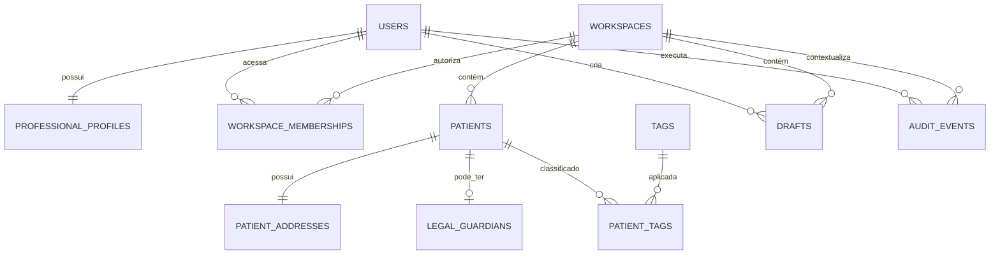

# Modelo conceitual de dados

**Status:** modelo conceitual aprovado para o primeiro incremento; schema físico depende do spike e das migrações.

## Entidades

| Entidade | Finalidade | Relações/invariantes principais |
|---|---|---|
| `users` | identidade local | papel `nutritionist` ou `administrator`; senha somente como hash |
| `professional_profiles` | perfil profissional | exatamente um por usuário; logotipo e assinatura referenciam arquivos privados |
| `workspaces` | separação por domínio | tipo `health` no MVP; preparado para `education` futuro |
| `workspace_memberships` | acesso de usuário ao espaço | usuário e espaço únicos; papéis aprovados têm acesso total |
| `patients` | cadastro central no Saúde | pertence ao espaço; CPF normalizado único; arquivamento sem exclusão |
| `patient_addresses` | endereço estruturado | um endereço principal no incremento 1 |
| `legal_guardians` | responsável quando aplicável | pertence ao paciente; CPF e contato validados |
| `tags` | classificação configurável | pertence ao espaço; pode ser desativada sem apagar histórico |
| `patient_tags` | relação paciente/tag | relação única; preservada ao arquivar |
| `drafts` | criação incompleta recuperável | usuário, espaço, tipo, UUID, expiração e conteúdo protegido |
| `audit_events` | trilha de ações críticas | ator, UTC, espaço, ação, entidade, resultado e metadados não clínicos |
| `backup_history` | resultado de backups/restaurações | caminho lógico, instante, checksum, tamanho, versão e resultado |

## Relações

## Convenções aprovadas

- IDs internos UUID.
- Instantes em UTC; data de nascimento sem conversão de fuso.
- CPF armazenado normalizado e exibido mascarado onde definido.
- Sem exclusão física de pacientes no MVP.
- Arquivos físicos usam UUID; nome original fica apenas como metadado.
- Foreign keys ativas em toda conexão.
- Migrações numeradas, transacionais e testadas em banco vazio e atualização.

## Pendências do projeto físico

- biblioteca SQLite e estratégia de pool/conexão;
- SQLCipher ou alternativa;
- índice de pesquisa sem acentos;
- formato protegido do conteúdo de rascunho;
- política legal definitiva de retenção;
- schema dos módulos clínicos posteriores.
