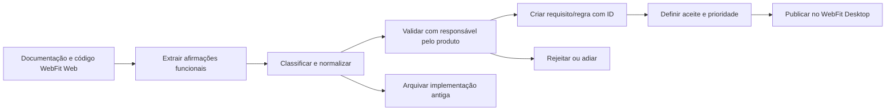
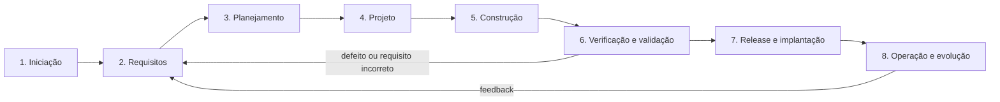

# Curadoria documental e ciclo de desenvolvimento — WebFit Desktop

## Status e propósito

- Decisão registrada em **13/08/2026**.
- O WebFit Desktop começa como um produto novo, não como continuação técnica da aplicação web.
- A documentação existente será usada como material de descoberta, não copiada integralmente.
- Somente visão do produto, funcionalidades, comportamentos, regras de negócio, fluxos, terminologia e necessidades do usuário podem originar requisitos do Desktop.
- Arquitetura web, Supabase, estado de implementação, dívidas técnicas e recomendações específicas do projeto antigo não serão importados como documentação vigente.

Este documento complementa o [Plano de migração — WebFit Desktop](legacy-migration.md) e define como reconstruir a documentação e iniciar o desenvolvimento segundo um ciclo formal de engenharia de software.

## Princípio de migração documental

A unidade de importação não é o arquivo antigo; é uma afirmação validada sobre o produto.



Uma frase como “a consulta é salva no `localStorage`” não será importada. A necessidade funcional “o profissional pode agendar uma consulta vinculada a um paciente” poderá ser importada depois de validada.

## O que pode ser importado

- Objetivo e proposta de valor do produto.
- Público-alvo e personas confirmadas.
- Vocabulário de nutrição e consultório.
- Jornadas do profissional.
- Funcionalidades desejadas.
- Regras de negócio independentes de tecnologia.
- Campos e validações de formulários.
- Estados e transições dos registros.
- Comportamento esperado da interface.
- Relatórios e informações que o usuário precisa consultar.
- Critérios de aceitação já confirmados.
- Backlog e solicitações de stakeholder, sempre como candidatos a validação.

## O que não pode ser importado como verdade vigente

- Supabase, PostgreSQL, RLS, Auth, Storage, Realtime e Edge Functions.
- `localStorage`, APIs, contextos React e organização atual do código.
- Estado “implementado”, “remoto”, “local” ou “simulado” da aplicação antiga.
- Roadmap técnico web.
- Resultados de auditoria do repositório web.
- Configuração de deploy, staging ou hospedagem.
- Decisões de CI/CD exclusivas da aplicação web.
- Limites e preços de provedores.
- Bugs e dívidas que só existem por causa da arquitetura abandonada.
- Afirmações dos documentos WebDiet não confirmadas para o WebFit.
- Recursos de plano “Black/Pro”, monetização e bloqueios de assinatura ainda não aprovados.
- Comportamentos simulados apresentados como se fossem regras do produto.

## Classificação das fontes atuais

### Importar por extração seletiva

| Fonte | Conteúdo aproveitável | Remover ou revalidar |
|---|---|---|
| `docs/01_Visao_Geral.md` | público-alvo, visão, navegação e glossário | WebDiet, requisitos de navegador, planos e recursos premium |
| `docs/02_Guia_Consultorio.md` | pacientes, agenda, pré-consulta, alimentos, receitas, financeiro, impressos e jornada de atendimento | afirmações não comprovadas e integrações remotas |
| `docs/03_Dashboard_Painel_Controle.md` | informações e atalhos esperados no painel | comunidade, app do paciente e prescrições sem regra validada |
| `docs/04_Notificacoes_Comunicacao.md` | comportamentos candidatos de notificação e templates | WhatsApp, chat remoto e automações fora do MVP local |
| `docs/05_Guia_Rapido.md` | jornada “do primeiro acesso ao atendimento” | passos que dependem da versão web antiga |
| `docs/04-modulos-fluxos.md` | mapa funcional, fluxos e perguntas de negócio | estado atual, persistência, Supabase e arquitetura remota |
| `docs/doc_stakeholder.md` | decisões de escopo, funcionalidades a manter e melhorias solicitadas | referências WebDiet e itens ainda não confirmados |
| `backlog-webfit.md` | solicitações de UI e discovery | pendências de áudio sem evidência disponível |
| `src/modules/*/rules.md` | regras e comportamentos candidatos por domínio | `localStorage`, simulações, planos premium e regras contraditórias |
| `src/types/index.ts` | nomes de entidades e campos candidatos | formatos de apresentação, nulabilidade e tipos definidos por conveniência da UI |

### Extrair somente restrições de produto e qualidade

| Fonte | Extrair | Não importar |
|---|---|---|
| `docs/01-estado-atual.md` | catálogo de capacidades e distinção entre produto real/simulado | inventário técnico e maturidade do WebFit Web |
| `docs/03-dados-seguranca.md` | sensibilidade dos dados, necessidade de acesso, auditoria, backup, retenção e recuperação | schema PostgreSQL, policies RLS e riscos Supabase específicos |
| `docs/05-qualidade-operacao.md` | necessidade de testes, acessibilidade, Definition of Done e recuperação | pipeline, ambientes e comandos web atuais |
| `docs/06-analise-recomendacoes.md` | dúvidas de produto, prioridades e riscos ainda relevantes | avaliação arquitetural e recomendações de nuvem |
| `docs/08-decisoes-convencoes.md` | modelo de ADR, disciplina documental e princípios gerais | convenções SQL/Supabase e estrutura web antiga |

### Manter apenas no arquivo histórico do WebFit Web

| Fonte | Motivo |
|---|---|
| `docs/00_Indice.md` | índice da documentação legada WebDiet |
| `docs/02-arquitetura.md` | descreve a arquitetura abandonada |
| `docs/07-roadmap.md` | roadmap remoto/web pausado |
| `docs/09-auditoria-qualidade.md` | fotografia de qualidade do repositório antigo |
| `docs/README.md` | índice e regras da documentação antiga |
| `supabase/` | implementação de banco e segurança usada apenas como referência de migração |
| `src/lib/supabase.ts` e repositórios atuais | implementação técnica substituída |

### Documento de transição

O plano de migração acompanha temporariamente o novo projeto em `docs/project/legacy-migration.md`. Depois do corte definitivo, ele poderá ser movido para o histórico.

## Regra para documentos legados

Nenhum arquivo legado será colado diretamente na documentação oficial do Desktop. O conteúdo deve passar por estas etapas:

1. identificar uma afirmação funcional;
2. registrar sua fonte e trecho de origem;
3. remover detalhes de implementação;
4. detectar conflito ou ambiguidade;
5. classificar como proposta, validada, aprovada, adiada ou rejeitada;
6. atribuir identificador estável;
7. definir critérios de aceite verificáveis;
8. publicar no documento canônico correspondente;
9. manter rastreabilidade até teste e versão entregue.

## Conflitos que precisam ser resolvidos antes da importação

| Tema | Afirmações conflitantes ou incompletas | Decisão necessária |
|---|---|---|
| Agendamento inicial | documentos alternam entre “agendado” e “confirmado” | definir máquina de estados e estado inicial |
| Cancelamento | regra antiga remove registro; schema posterior arquiva | definir cancelamento, exclusão e retenção |
| Retorno e cobrança | retorno gera cobrança automaticamente como paga | confirmar se cria cobrança, qual status e possibilidade de desfazer |
| CPF | aparece como campo, mas obrigatoriedade e unicidade não são claras | definir quando exigir, normalização e duplicidade |
| Nome social/apelido | preenchimento automático com primeiro nome | validar edição e uso em relatórios/documentos |
| Consulta online | existe como modalidade, mas Desktop é offline | decidir se é apenas classificação ou se implica videochamada |
| Chat e diário | pressupõem acesso do paciente em outro dispositivo | retirar do MVP local ou redesenhar como registro manual |
| Planos Pro/Black | bloqueios foram simulados | remover até existir estratégia comercial aprovada |
| Exclusão de pacientes | há lixeira, soft delete e retenção clínica/financeira | definir política funcional e legal |
| Auditoria | não está claro quem pode consultar e por quanto tempo | definir finalidade, acesso e retenção |
| Multi-clínica | schema suporta; experiência atual usa a primeira clínica | confirmar se o Desktop MVP precisa de uma ou várias clínicas |
| Usuários locais | owner, nutricionista e assistente existem conceitualmente | definir permissões por ação e necessidade no MVP |
| Datas e horários | formatos de tela foram tratados como armazenamento | definir regra de timezone, UTC e apresentação |

Nenhuma dessas decisões deve ser tomada silenciosamente pelo código.

## Estrutura documental do novo projeto

```text
docs/
├── README.md
├── product/
│   ├── vision.md
│   ├── scope.md
│   ├── personas.md
│   ├── glossary.md
│   └── journeys.md
├── requirements/
│   ├── functional-requirements.md
│   ├── business-rules.md
│   ├── non-functional-requirements.md
│   ├── use-cases.md
│   ├── acceptance-criteria.md
│   └── traceability.md
├── ux/
│   ├── information-architecture.md
│   ├── flows.md
│   └── accessibility.md
├── architecture/
│   ├── overview.md
│   ├── data-model.md
│   ├── security.md
│   └── adr/
├── quality/
│   ├── test-strategy.md
│   ├── test-plan.md
│   └── definition-of-done.md
├── operations/
│   ├── installation.md
│   ├── backup-restore.md
│   ├── data-export.md
│   └── incident-response.md
└── project/
    ├── roadmap.md
    ├── risk-register.md
    ├── decision-log.md
    └── legacy-migration.md
```

Documentos de produto dizem **o quê e por quê**. Documentos de arquitetura dizem **como**. Um requisito funcional não deve mencionar Tauri, Rust, SQLite ou nome de biblioteca, salvo quando a própria restrição tecnológica tiver sido aprovada como requisito.

## Identificação e rastreabilidade

### Padrão de IDs

| Tipo | Formato | Exemplo |
|---|---|---|
| Requisito funcional | `RF-<DOM>-NNN` | `RF-PAT-001` cadastrar paciente |
| Regra de negócio | `RN-<DOM>-NNN` | `RN-AGE-003` impedir conflito de agenda |
| Requisito não funcional | `RNF-<CAT>-NNN` | `RNF-SEG-002` bloquear após inatividade |
| Caso de uso | `UC-<DOM>-NNN` | `UC-PRE-001` emitir prescrição |
| Decisão arquitetural | `ADR-NNNN` | `ADR-0001` adotar Tauri e SQLite |
| Risco | `RSK-NNN` | `RSK-004` ausência de backup recente |
| Teste de aceite | `TA-<DOM>-NNN` | `TA-PAT-001` validar cadastro mínimo |

Siglas iniciais de domínio: `AUT` autenticação, `CLI` clínica, `PAT` pacientes, `AGE` agenda, `ANA` anamnese, `ANT` antropometria, `PRE` prescrições, `FIN` financeiro, `PLN` planner, `ARQ` arquivos, `REL` relatórios, `BKP` backup e `AUD` auditoria.

### Campos mínimos de um requisito

```text
ID:
Título:
Descrição:
Justificativa/valor:
Ator:
Pré-condições:
Fluxo principal:
Fluxos alternativos e erros:
Regras relacionadas:
Dados envolvidos:
Critérios de aceite:
Prioridade:
Status:
Fonte legada:
Dependências:
Testes relacionados:
Versão entregue:
```

### Estados documentais

```text
proposto -> em análise -> validado -> aprovado -> implementado -> verificado
                         \-> adiado
                         \-> rejeitado
```

“Existe na tela antiga” não equivale a “aprovado”. “Implementado” não equivale a “verificado”.

## Ciclo de desenvolvimento adotado

O processo será incremental e orientado a riscos. Ele usa as fases clássicas da engenharia de software, mas não funciona como uma cascata rígida: cada incremento percorre análise, projeto, construção, testes e aceite.



## Fase 1 — Iniciação e viabilidade

### Atividades

- Definir problema, público e proposta de valor.
- Confirmar que o produto inicial é Desktop local e Windows-first.
- Identificar stakeholders e responsável por aprovar requisitos.
- Definir objetivos mensuráveis do MVP.
- Registrar restrições: offline, sem mensalidade, um computador e dados clínicos.
- Avaliar viabilidade técnica, operacional, econômica e legal.
- Criar registro inicial de riscos.
- Aprovar o escopo explicitamente excluído.

### Entregáveis

- visão do produto;
- termo de abertura/iniciação;
- personas iniciais;
- escopo e não escopo;
- análise de viabilidade;
- registro de riscos;
- `ADR-0001` para Desktop/Tauri/SQLite.

### Gate G1 — Visão aprovada

O projeto avança quando problema, usuário, escopo local, autoridade de decisão e limites do MVP estiverem aprovados.

## Fase 2 — Elicitação e análise de requisitos

### Atividades

- Fazer a curadoria das fontes listadas neste documento.
- Entrevistar ou validar decisões com o responsável pelo produto.
- Mapear jornadas completas, não apenas telas.
- Criar requisitos funcionais e regras de negócio.
- Criar requisitos não funcionais de segurança, desempenho, usabilidade, acessibilidade, recuperação e portabilidade.
- Modelar entidades e vocabulário do domínio.
- Resolver contradições antes de programar.
- Escrever critérios de aceite observáveis.
- Priorizar por valor, risco e dependência.

### Entregáveis

- especificação de requisitos;
- catálogo de regras de negócio;
- casos de uso;
- jornadas e fluxos;
- glossário;
- modelo conceitual de dados;
- matriz de rastreabilidade;
- backlog priorizado do MVP.

### Gate G2 — Baseline de requisitos

O MVP avança para projeto quando cada item de escopo possuir ID, descrição, prioridade, critérios de aceite, origem e ausência de conflito conhecido.

## Fase 3 — Planejamento

### Atividades

- Decompor MVP em incrementos verticais utilizáveis.
- Estimar esforço somente depois de estabilizar os requisitos.
- Definir dependências e caminho crítico.
- Planejar qualidade, configuração, releases e mudanças.
- Definir critérios de entrada e saída de cada incremento.
- Definir estratégia para protótipos e spikes.

### Entregáveis

- roadmap por incrementos;
- backlog técnico vinculado a requisitos;
- plano de testes;
- plano de riscos;
- plano de configuração e versionamento;
- estratégia de release.

### Gate G3 — Plano executável

O trabalho avança quando o primeiro incremento tiver escopo pequeno, dependências resolvidas, riscos conhecidos e testes de aceite definidos.

## Fase 4 — Projeto da solução

### Atividades

- Projetar arquitetura de módulos e fronteiras de domínio.
- Projetar IPC tipado e autorização no backend.
- Projetar schema SQLite, migrações e transações.
- Projetar autenticação e proteção das chaves.
- Projetar arquivos, backup, restauração e exportação.
- Criar protótipos de UX dos fluxos críticos.
- Registrar decisões e alternativas em ADRs.
- Fazer spike dos riscos bloqueantes, especialmente criptografia e instalador.

### Entregáveis

- arquitetura lógica e física;
- modelo lógico de dados;
- contratos frontend/backend;
- modelo de segurança e ameaças;
- protótipos navegáveis;
- ADRs;
- resultado dos spikes.

### Gate G4 — Projeto verificável

A construção começa quando arquitetura, dados, segurança, backup e UX do incremento puderem ser relacionados aos requisitos e testados.

## Fase 5 — Construção incremental

Cada incremento deve entregar uma capacidade ponta a ponta, evitando construir todas as telas antes da persistência.

### Ordem sugerida

1. Instalação, banco, migração e diagnóstico.
2. Primeiro administrador, login e bloqueio.
3. Clínica e perfil profissional.
4. Pacientes.
5. Agenda.
6. Anamnese e antropometria.
7. Prescrições.
8. Financeiro.
9. Planner.
10. Arquivos, relatórios, backup, restauração e exportação.

### Práticas obrigatórias

- revisão de código;
- testes junto com a implementação;
- migrações versionadas;
- commits vinculados a requisito/tarefa;
- tratamento explícito de erro;
- nenhuma ação simulando sucesso;
- nenhuma informação clínica em logs;
- atualização documental na mesma mudança.

### Gate G5 — Incremento construído

O incremento só termina quando requisitos, código, testes, documentação e rastreabilidade estiverem sincronizados.

## Fase 6 — Verificação e validação

### Verificação — construímos corretamente?

- testes unitários;
- testes de integração SQLite;
- testes de migração;
- testes dos contratos IPC;
- análise estática;
- revisão de segurança;
- testes de falha, corrupção e disco cheio;
- testes de instalador e atualização.

### Validação — construímos o produto correto?

- execução dos casos de aceite pelo responsável do produto;
- testes de usabilidade com tarefas reais;
- comparação com jornadas e regras aprovadas;
- validação dos relatórios e cálculos;
- restauração completa em instalação limpa;
- registro formal das divergências.

### Gate G6 — Release candidate aprovado

Nenhum requisito crítico permanece sem teste, nenhum defeito bloqueante está aberto e o backup foi restaurado com sucesso.

## Fase 7 — Release e implantação

### Atividades

- gerar instalador reproduzível;
- assinar e versionar o pacote quando aplicável;
- testar instalação, atualização e desinstalação;
- preservar dados durante atualização;
- criar manual do usuário;
- criar manual de backup e recuperação;
- registrar versão, alterações e limitações;
- executar piloto com dados controlados antes de dados reais.

### Gate G7 — Liberação para uso real

O aplicativo só recebe dados reais após aprovação da Definition of Done, restauração exercitada, instruções entregues e riscos residuais aceitos.

## Fase 8 — Operação, manutenção e evolução

### Atividades

- acompanhar erros e saúde do backup localmente;
- receber solicitações por processo controlado;
- classificar defeitos, melhorias e novos requisitos;
- avaliar impacto antes de mudar schema ou comportamento;
- manter compatibilidade de atualização;
- revisar segurança e dependências;
- revisar periodicamente os gatilhos para sair de SQLite.

Toda mudança significativa reinicia o ciclo em requisitos e análise de impacto; não começa diretamente pela edição de código.

## MVP funcional proposto para validação

### Dentro do MVP

- instalação e primeiro acesso;
- usuário administrador local;
- bloqueio e troca de senha;
- perfil do profissional e clínica;
- cadastro, busca, edição e arquivamento de pacientes;
- agenda e ciclo de vida da consulta;
- anamnese;
- antropometria e histórico;
- prescrições e versões;
- financeiro básico;
- planner;
- arquivos clínicos;
- relatórios/PDFs prioritários;
- auditoria;
- backup, restauração e exportação.

### Fora do MVP

- chat remoto;
- diário enviado pelo paciente;
- notificações push;
- WhatsApp automatizado;
- portal/app do paciente;
- teleconsulta;
- estudos, cursos e podcast;
- marketing, landing page e mailing;
- benefícios, vouchers e wearables;
- planos pagos e bloqueios comerciais;
- sincronização entre computadores.

A divisão é uma proposta para a fase de requisitos, não aprovação automática. Ela deve ser confirmada no Gate G1.

## Primeiro ciclo antes de escrever o produto

### Ciclo 0 — Descoberta e baseline

- [ ] Aprovar visão, público e problema.
- [ ] Aprovar MVP e não escopo.
- [ ] Definir se haverá uma ou várias clínicas locais.
- [ ] Definir usuários e matriz de permissões.
- [ ] Consolidar glossário.
- [ ] Mapear jornada “instalar até concluir primeiro atendimento e backup”.
- [ ] Extrair requisitos candidatos das fontes funcionais.
- [ ] Resolver os conflitos listados neste documento.
- [ ] Criar requisitos não funcionais mensuráveis.
- [ ] Aprovar critérios de aceite dos fluxos críticos.
- [ ] Criar matriz inicial de rastreabilidade.
- [ ] Registrar riscos e ADR da arquitetura.

### Ciclo 1 — Prova da fundação

Somente após G1 e uma baseline mínima de G2:

- [ ] gerar shell Tauri + React;
- [ ] criar SQLite com migrações;
- [ ] implementar primeiro administrador;
- [ ] implementar criar/listar paciente por comandos tipados;
- [ ] fechar e reabrir mantendo dados;
- [ ] validar criptografia;
- [ ] gerar instalador;
- [ ] criar e restaurar backup;
- [ ] executar os testes de aceite relacionados.

## Definition of Ready de um requisito

Um requisito pode entrar em desenvolvimento quando:

- possui ID único;
- tem ator e valor claros;
- não contém decisão técnica desnecessária;
- possui fluxo principal, alternativas e erros relevantes;
- contém critérios de aceite testáveis;
- tem regras de negócio relacionadas;
- dependências e dados envolvidos são conhecidos;
- conflitos foram resolvidos;
- prioridade foi aprovada;
- riscos de privacidade e segurança foram avaliados;
- está ligado à matriz de rastreabilidade.

## Definition of Done de um incremento

- requisitos implementados e vinculados;
- critérios de aceite executados;
- testes unitários e de integração aprovados;
- migrações testadas em banco vazio e atualização;
- erros e falhas esperadas tratados;
- acessibilidade do fluxo revisada;
- segurança e privacidade revisadas;
- documentação atualizada;
- instalador ou build reproduzível;
- backup/restauração testados quando houver impacto em dados;
- responsável pelo produto validou o comportamento;
- riscos residuais registrados.

## Resultado esperado da curadoria

Ao final do Ciclo 0, o novo repositório não conterá uma cópia da documentação antiga. Ele conterá uma especificação nova, coerente e rastreável do WebFit Desktop. Cada requisito preservará sua fonte histórica quando útil, mas nenhuma tecnologia abandonada será carregada como obrigação do produto.
