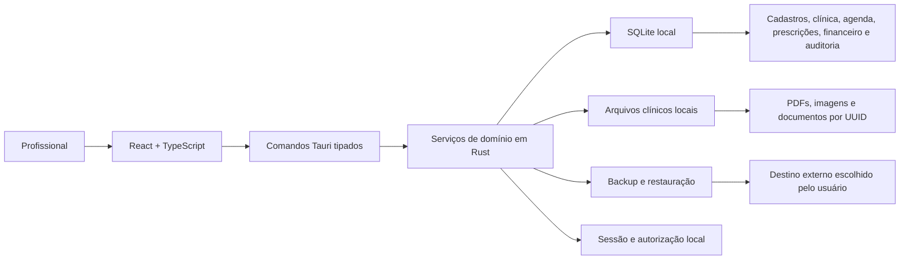

# Plano de migração — WebFit Desktop

## Status da decisão

- Decisão registrada em **13/08/2026**.
- O desenvolvimento da versão web fica **pausado** e preservado como referência funcional e técnica.
- O novo produto será chamado **WebFit Desktop**.
- A primeira versão será local, offline, orientada a Windows e sem dependência de hospedagem ou mensalidade.
- Este plano não autoriza apagar o projeto web, a instância Supabase ou dados existentes.
- A seleção e reescrita da documentação funcional seguirá o [Plano de curadoria documental e ciclo de desenvolvimento](development-lifecycle.md); arquivos antigos não serão copiados integralmente.

## Resumo executivo

O WebFit Desktop reutilizará a interface React/TypeScript existente, mas trocará a arquitetura de SPA conectada ao Supabase por uma aplicação desktop Tauri com banco SQLite nativo. A migração será seletiva: componentes, estilos, regras e testes aproveitáveis serão importados; código de persistência Supabase, `localStorage` sensível, artefatos gerados e simulações não serão copiados como fundação da nova aplicação.

A arquitetura-alvo é:



## Objetivos

1. Entregar um aplicativo instalável que funcione sem internet, Docker ou serviços em nuvem.
2. Preservar o valor já produzido na interface e nas regras de negócio.
3. Substituir Supabase e `localStorage` por persistência SQLite consistente.
4. Proteger dados clínicos com autenticação local, autorização, auditoria, backup e criptografia adequada.
5. Manter o domínio desacoplado o suficiente para uma futura edição em nuvem, sem prometer sincronização nesta fase.
6. Fazer a transição com validação de dados, rollback e sem apagar prematuramente a origem.

## Não objetivos da primeira versão

- Portal ou aplicativo remoto do paciente.
- Chat entre dispositivos.
- Diário alimentar enviado pelo celular.
- Sincronização entre computadores.
- Site público, recebimento de leads ou webhooks.
- Teleconsulta integrada.
- Trabalho simultâneo de vários computadores no mesmo arquivo SQLite.
- Atualização automática dependente de um servidor próprio.

Esses recursos ficam fora do MVP Desktop. Se algum deles se tornar requisito imediato, a arquitetura deve ser reavaliada antes da implementação.

## Premissas que sustentam SQLite

- Um banco pertence a uma instalação do WebFit Desktop.
- O uso principal ocorre em um único computador.
- Pode haver mais de um usuário local, mas não várias máquinas escrevendo simultaneamente.
- Os arquivos e o banco permanecem no disco local.
- O operador assume responsabilidade pelos backups e receberá orientação explícita dentro do aplicativo.
- Compartilhar o arquivo SQLite por OneDrive, Google Drive, Dropbox, pasta de rede ou pendrive **não será suportado**.

## Stack tecnológica aprovada

| Camada | Escolha | Decisão |
|---|---|---|
| Desktop | Tauri 2 | empacotamento, janela nativa, IPC e permissões |
| Interface | React 18 + TypeScript + Vite | manter e adaptar o investimento atual |
| Backend local | Rust | comandos restritos, domínio, acesso a dados e arquivos |
| Banco | SQLite | armazenamento local transacional e sem servidor |
| Criptografia do banco | spike com SQLCipher | obrigatória antes de dados clínicos reais se a proteção de disco não for suficiente |
| Segredos locais | armazenamento seguro do sistema operacional | nunca salvar chave de criptografia em código ou texto puro |
| Arquivos clínicos | filesystem privado + metadados no SQLite | não colocar arquivos grandes como BLOB por padrão |
| Testes de UI | Vitest + Testing Library | reaproveitar a base existente |
| Testes nativos | `cargo test` + testes de integração SQLite | validar migrações, regras e backup |
| Empacotamento inicial | Windows MSI/NSIS | plataforma inicial do produto |

### Decisão de segurança da ponte frontend/backend

O frontend não receberá uma ponte de SQL genérica. Em vez de liberar `SELECT` e `execute` arbitrários para a WebView, o backend exporá comandos de negócio pequenos e tipados, por exemplo:

```text
patient_list
patient_create
patient_update
patient_archive
appointment_schedule
prescription_save
backup_create
backup_restore
```

Cada comando valida entrada, sessão, permissão e transação antes de acessar o banco. Isso reduz o impacto de falhas na interface e mantém SQL fora dos componentes React.

## Estratégia de repositórios

### Projeto atual

O repositório WebFit atual será congelado como referência. Antes de iniciar a nova aplicação:

1. registrar o estado conhecido do código;
2. executar build, tipos, lint e testes;
3. documentar falhas já existentes;
4. criar uma tag de preservação, sugerida como `webfit-web-frozen-2026-08-13`;
5. não incluir `.env`, segredos, `node_modules` ou artefatos de `dist` na cópia;
6. não apagar o projeto ou dados Supabase até concluir e conferir toda importação necessária.

### Novo projeto

Criar um repositório separado, sugerido como:

```text
WebFit-Desktop/
├── src/                         # frontend React
│   ├── app/
│   ├── domains/
│   ├── shared/
│   └── styles/
├── src-tauri/
│   ├── src/
│   │   ├── commands/
│   │   ├── domain/
│   │   ├── repositories/
│   │   ├── security/
│   │   ├── backup/
│   │   └── files/
│   ├── migrations/
│   ├── capabilities/
│   └── tauri.conf.json
├── tests/
├── docs/
└── package.json
```

Não criar o Desktop como subpasta permanente do WebFit Web. Os dois produtos terão ciclos, dependências e históricos diferentes.

## O que será reaproveitado

| Origem atual | Tratamento no Desktop |
|---|---|
| componentes visuais reutilizáveis | copiar seletivamente e corrigir dependências |
| módulos de pacientes, agenda, financeiro e ferramentas | portar por fluxo, não copiar o módulo inteiro às cegas |
| tokens, temas e CSS | reaproveitar após remover estilos mortos |
| tipos de domínio | revisar nomes, datas, dinheiro e nulabilidade |
| testes de componentes | portar quando expressarem comportamento válido |
| regras em `rules.md` | usar como insumo e validar com o produto |
| migrações PostgreSQL | referência para modelar SQLite, não execução direta |
| documentação funcional | preservar como fonte de descoberta |

## O que não será reaproveitado como fundação

- `src/lib/supabase.ts`.
- `AuthContext` baseado em sessão Supabase.
- `WorkspaceContext` dependente da Data API.
- Repositórios Supabase atuais.
- Policies RLS e funções `auth.uid()` como mecanismo executável.
- Bucket e policies do Supabase Storage.
- `localStorage` para dados de domínio.
- Simulações que exibem sucesso sem realizar a operação.
- `node_modules`, `dist`, chaves e arquivos `.env`.
- Componentes legados sem uso comprovado.

## Modelo de dados SQLite

### Convenções obrigatórias

- IDs de domínio em UUID armazenado como `TEXT`.
- Datas e horários em UTC, no formato ISO-8601, salvo datas civis sem horário.
- Valores monetários em centavos inteiros, nunca `REAL`.
- Booleanos em `INTEGER` com `CHECK (value IN (0, 1))`.
- Enums em `TEXT` com `CHECK` ou tabela de domínio.
- Tags e listas relacionais em tabelas associativas; JSON somente quando a estrutura for realmente flexível.
- Todas as tabelas mutáveis com `created_at`, `updated_at` e, quando aplicável, `deleted_at`.
- Migrações numeradas, transacionais e testadas desde um banco vazio e desde a versão anterior.
- `PRAGMA foreign_keys = ON` em toda conexão.
- WAL, `busy_timeout` e estratégia de checkpoint configurados e testados.
- `PRAGMA integrity_check` e `foreign_key_check` incorporados ao diagnóstico e à restauração.

### Tabelas iniciais propostas

```text
schema_migrations
app_users
user_sessions
clinics
clinic_members
patients
patient_tags
appointments
prescriptions
prescription_versions
anthropometry_entries
financial_transactions
planner_tasks
clinical_files
app_settings
message_templates
audit_logs
backup_history
```

Conversas, mensagens, notificações remotas, diário alimentar e integrações não entram no primeiro schema apenas porque existem no schema Supabase. Só devem ser modelados quando houver um fluxo local aprovado.

### Diferenças relevantes em relação ao PostgreSQL

| PostgreSQL/Supabase | WebFit Desktop |
|---|---|
| `uuid` | UUID em `TEXT` |
| `timestamptz` | `TEXT` UTC ISO-8601 |
| `numeric(12,2)` | centavos em `INTEGER` |
| `jsonb` | tabelas normalizadas ou JSON em `TEXT` validado |
| `text[]` | tabela associativa |
| enums nativos | `TEXT` + `CHECK` |
| `auth.users` | `app_users` local |
| `auth.uid()` | identidade da sessão no backend |
| RLS | autorização obrigatória nos serviços/comandos |
| Supabase Storage | pasta privada e tabela `clinical_files` |
| Realtime | eventos internos do processo |

## Autenticação, autorização e auditoria

### Autenticação local

- O primeiro uso cria o administrador local.
- Senhas nunca são armazenadas diretamente; usar derivação de senha resistente a força bruta.
- Implementar bloqueio temporário após tentativas repetidas.
- Implementar bloqueio da aplicação por inatividade.
- Troca de senha exige a senha atual ou procedimento explícito de recuperação local.
- Não criar “senha mestra” oculta no produto.

### Autorização

Os papéis iniciais serão `owner`, `nutritionist` e `assistant`, mas a matriz precisa ser decidida antes de implementar os comandos. Nenhum papel recebe acesso por simples existência; cada operação é autorizada no backend.

### Auditoria

- Registrar criação, alteração, arquivamento, restauração, login, falha de login, exportação, backup e restauração.
- Não registrar senha, chave de criptografia ou conteúdo integral desnecessário.
- Auditoria local ajuda na rastreabilidade, mas não é inviolável contra um administrador do computador.

## Armazenamento de arquivos

- Guardar os arquivos em diretório privado do aplicativo.
- Usar UUID como nome físico; nome original fica somente no banco.
- Registrar tipo MIME, tamanho, hash SHA-256, paciente, autor e data.
- Validar extensão, MIME e tamanho antes da cópia.
- Fazer escrita atômica: arquivo temporário, hash, persistência dos metadados e renomeação final.
- Detectar arquivo ausente, órfão ou com hash divergente no diagnóstico.
- Arquivamento lógico não apaga imediatamente o arquivo; retenção será definida separadamente.

## Backup e restauração

O backup é parte do produto, não uma instrução externa opcional.

### Conteúdo do pacote

```text
webfit-backup-AAAA-MM-DD-HHMM/
├── manifest.json
├── database.sqlite
├── files/
└── checksums.sha256
```

O formato distribuído deverá ser um pacote criptografado com extensão própria, por exemplo `.webfit-backup`.

### Regras

- Gerar snapshot consistente usando a API de backup do SQLite ou mecanismo equivalente.
- Incluir banco e arquivos no mesmo manifesto.
- Calcular checksums antes de concluir.
- Nunca substituir o banco ativo diretamente durante uma restauração.
- Restaurar primeiro em área temporária, validar versão, integridade, FKs, checksums e espaço livre.
- Criar backup de segurança do estado atual antes da troca.
- Manter histórico visível de backups e resultado da última verificação.
- Alertar quando não houver backup recente.
- Testar restauração como parte do critério de release.

## Migração de dados existentes

Existem três origens possíveis e elas serão tratadas separadamente.

### 1. Supabase

- Exportar apenas se houver dados reais que precisem ser preservados.
- Exportar tabelas em formato estruturado mantendo UUIDs e relacionamentos.
- Exportar arquivos do Storage separadamente.
- Não depender de dump PostgreSQL como formato de entrada do Desktop.
- Transformar os dados por um importador versionado.

### 2. `localStorage`

As chaves atuais precisam de uma exportação controlada antes de abandonar a aplicação web. O exportador legado deverá:

1. ler somente chaves WebFit conhecidas;
2. validar cada estrutura;
3. remover dados de demonstração identificáveis;
4. produzir JSON versionado;
5. apresentar contagens e erros;
6. não apagar a origem.

### 3. Dados simulados

Dados estáticos, mocks e eventos simulados não serão migrados como registros do usuário. Quando úteis, poderão virar fixtures de desenvolvimento separadas.

### Requisitos do importador Desktop

- modo de simulação sem escrita;
- importação transacional;
- idempotência por identificador de lote e registro;
- relatório de aceitos, ignorados e rejeitados;
- validação de CPF, datas, referências e valores;
- preservação de UUIDs quando válidos;
- rollback integral em erro estrutural;
- comparação de contagens por entidade;
- log do hash do arquivo importado;
- confirmação do usuário antes da gravação definitiva.

O Supabase e a aplicação web só poderão ser desativados depois de uma importação validada e de um backup do Desktop restaurado com sucesso.

## Fases de execução

### Fase 0 — Congelamento e inventário

- [ ] Confirmar escopo local e Windows-first.
- [ ] Congelar o WebFit Web e registrar tag/commit.
- [ ] Executar e registrar testes do estado congelado.
- [ ] Inventariar componentes, estilos, domínios e dados aproveitáveis.
- [ ] Identificar se existem dados reais no Supabase ou `localStorage`.
- [ ] Registrar ADR da mudança para Desktop/SQLite.

**Critério de saída:** origem preservada, inventário aprovado e nenhum dado sem estratégia de exportação.

### Fase 1 — Spike técnico bloqueante

- [ ] Criar aplicação mínima Tauri 2 + React + TypeScript.
- [ ] Criar e migrar um SQLite local.
- [ ] Validar instalação limpa no Windows.
- [ ] Validar caminho de dados por usuário.
- [ ] Validar IPC tipado sem SQL genérico exposto.
- [ ] Validar SQLCipher ou documentar a alternativa aprovada.
- [ ] Criar e restaurar um backup mínimo.
- [ ] Medir tamanho do instalador e consumo básico.

**Critério de saída:** instalador abre, cria banco, grava um paciente, fecha, reabre e restaura backup com dados íntegros.

### Fase 2 — Fundação do produto

- [ ] Criar estrutura por domínios.
- [ ] Definir contratos TypeScript dos comandos.
- [ ] Implementar envelope padronizado de erros.
- [ ] Criar migrações e seed apenas de desenvolvimento.
- [ ] Configurar foreign keys, WAL, timeout e diagnóstico.
- [ ] Implementar logging sem conteúdo clínico sensível.
- [ ] Criar pipeline com frontend, Rust, testes e build.

**Critério de saída:** clone limpo gera aplicativo e banco reproduzíveis.

### Fase 3 — Shell visual e autenticação local

- [ ] Portar tokens, temas, layout e navegação.
- [ ] Portar componentes compartilhados aprovados.
- [ ] Implementar criação do primeiro administrador.
- [ ] Implementar login, logout, bloqueio e troca de senha.
- [ ] Implementar clínica e perfil profissional locais.
- [ ] Definir matriz de permissões.

**Critério de saída:** usuário instala, cria conta local, entra, bloqueia e reabre o aplicativo.

### Fase 4 — MVP clínico

- [ ] Pacientes com validação, busca, edição e arquivamento.
- [ ] Agenda com edição, status, duração e conflito.
- [ ] Anamnese e notas clínicas.
- [ ] Antropometria e histórico.
- [ ] Prescrições versionadas.
- [ ] Planner.
- [ ] Financeiro em centavos e operações transacionais.
- [ ] Auditoria dos fluxos críticos.
- [ ] Remover persistência de domínio do `localStorage`.

**Critério de saída:** atendimento básico completo sobre SQLite, sem Supabase e sem dados sensíveis no navegador.

### Fase 5 — Arquivos, relatórios e backup

- [ ] Implementar `clinical_files` e armazenamento privado.
- [ ] Importar, visualizar, exportar e arquivar arquivos.
- [ ] Gerar PDFs reais.
- [ ] Implementar pacote de backup criptografado.
- [ ] Implementar restauração assistida.
- [ ] Implementar diagnóstico de integridade.
- [ ] Criar lembretes e histórico de backup.

**Critério de saída:** banco e documentos sobrevivem a uma restauração limpa em outra instalação de teste.

### Fase 6 — Importação do WebFit Web

- [ ] Construir exportador legado se houver dados a preservar.
- [ ] Construir importador Desktop versionado.
- [ ] Executar simulação e corrigir inconsistências.
- [ ] Executar importação real em cópia de teste.
- [ ] Comparar contagens, referências e amostras.
- [ ] Obter aceite do responsável pelos dados.

**Critério de saída:** relatório de reconciliação aprovado e origem ainda recuperável.

### Fase 7 — Hardening e piloto

- [ ] Testar queda de energia/processo durante escrita.
- [ ] Testar disco cheio e pasta sem permissão.
- [ ] Testar banco corrompido e backup inválido.
- [ ] Testar atualização de schema entre versões.
- [ ] Testar caminhos com acentos e nomes longos.
- [ ] Testar acessibilidade e fluxos por teclado.
- [ ] Testar instalador, desinstalador e preservação dos dados.
- [ ] Revisar LGPD, retenção e procedimento de incidente.

**Critério de saída:** piloto utiliza dados controlados com backup restaurável e falhas críticas tratadas.

### Fase 8 — Corte definitivo

- [ ] Criar backup final das origens.
- [ ] Importar e reconciliar dados definitivos.
- [ ] Entregar manual de instalação, backup e recuperação.
- [ ] Marcar WebFit Web como arquivado/read-only.
- [ ] Manter exportações e documentação pelo período definido.
- [ ] Somente então avaliar remoção de recursos externos.

**Critério de saída:** WebFit Desktop é a única fonte ativa e existe rollback documentado.

## Ordem recomendada para importar a interface

1. Design tokens, fontes, ícones e componentes básicos.
2. Layout, navegação e tratamento global de erros.
3. Pacientes.
4. Agenda.
5. Perfil clínico, anamnese e antropometria.
6. Prescrições.
7. Financeiro.
8. Planner.
9. Arquivos e relatórios.
10. Configurações e módulos auxiliares comprovadamente úteis.

Não portar Estudos, Marketing, Site Builder, Chat, Diário, Teleconsulta e integrações antes de o MVP local estar concluído e o escopo desses módulos ser novamente aprovado.

## Estratégia de testes

| Nível | Cobertura mínima |
|---|---|
| Unidade TypeScript | validações, formatação, componentes e estados visuais |
| Unidade Rust | regras de domínio, autorização, caminhos e erros |
| Integração SQLite | migrações, constraints, transações, soft delete e auditoria |
| Contrato IPC | serialização, validação e códigos de erro |
| Importação | idempotência, rollback e reconciliação |
| Backup | criação, corrupção detectada e restauração completa |
| Instalação | instalação limpa, atualização e desinstalação sem perda silenciosa |
| Fluxo crítico | login, paciente, agenda, avaliação, prescrição e backup |

## Riscos e respostas

| Risco | Resposta planejada |
|---|---|
| SQLCipher dificultar build/assinatura | resolver no spike antes de portar módulos |
| copiar acoplamento do `AppContext` | migrar por domínio e repositório, não por pasta inteira |
| perder dados do navegador | exportador legado e congelamento da origem |
| usuário não realizar backup | backup guiado, lembretes e indicador de saúde |
| arquivo SQLite ser sincronizado por nuvem | detectar/alertar caminhos conhecidos e declarar não suportado |
| necessidade repentina de multiusuário remoto | parar expansão e reavaliar backend servidor |
| anexos se separarem do banco | manifesto, hashes e backup conjunto |
| atualização quebrar schema | migrações transacionais, backup pré-upgrade e rollback |
| falsa sensação de segurança local | criptografia, bloqueio, permissões e orientação operacional |

## Gatilhos para reavaliar SQLite

Reabrir a decisão arquitetural se ocorrer qualquer um destes fatos:

- dois computadores precisarem editar os mesmos dados;
- o paciente precisar acessar dados remotamente;
- houver necessidade de sincronização automática;
- a clínica exigir disponibilidade contínua em rede;
- integrações precisarem receber eventos externos;
- auditoria precisar ser resistente ao administrador local;
- houver obrigação operacional de administração centralizada.

Nessa situação, o Desktop poderá continuar como cliente, mas um backend central será necessário. SQLite não deve ser colocado em pasta de rede como solução improvisada.

## Primeiro ciclo de trabalho

Antes do spike técnico, executar o **Ciclo 0 — Descoberta e baseline** definido no plano de curadoria documental. Depois do Gate G1 e de uma baseline mínima de requisitos, o início técnico contém somente tarefas que reduzem incerteza:

Os prompts sequenciais para executar essa transição estão em [`docs/prompts/`](../prompts/00-iniciar-repositorio.md), começando pelo Prompt 00.

1. criar o repositório `WebFit-Desktop`;
2. registrar o ADR Desktop/SQLite;
3. gerar o shell Tauri + React;
4. criar uma migração SQLite mínima (`schema_migrations`, `app_users`, `clinics`, `patients`);
5. implementar um comando seguro de criar/listar pacientes;
6. persistir e reabrir o banco;
7. gerar instalador Windows;
8. validar a estratégia de criptografia;
9. criar e restaurar um backup;
10. somente depois iniciar a importação da interface completa.

## Definição de pronto do WebFit Desktop MVP

O MVP só pode receber dados reais quando:

- instala e atualiza sem exigir ferramentas de desenvolvimento;
- funciona offline depois da instalação;
- não depende de Supabase, Docker ou `localStorage` para dados de domínio;
- autenticação e autorização local estão testadas;
- banco e backups possuem proteção aprovada;
- todos os fluxos críticos usam transações e auditoria;
- backup completo foi restaurado em uma instalação limpa;
- corrupção e falta de espaço produzem erro seguro e compreensível;
- migrações foram testadas desde a versão anterior;
- arquivos clínicos estão incluídos e verificados no backup;
- há manual de instalação, segurança, backup e recuperação;
- existe procedimento documentado para exportar os dados do usuário.

## Decisão final

O WebFit Desktop não será uma cópia integral do WebFit Web. Será uma nova aplicação que reutiliza ativos validados e substitui conscientemente a infraestrutura de nuvem por serviços locais. O primeiro marco não é “todas as telas portadas”; é provar instalação, persistência, criptografia e restauração com um fluxo clínico mínimo.
